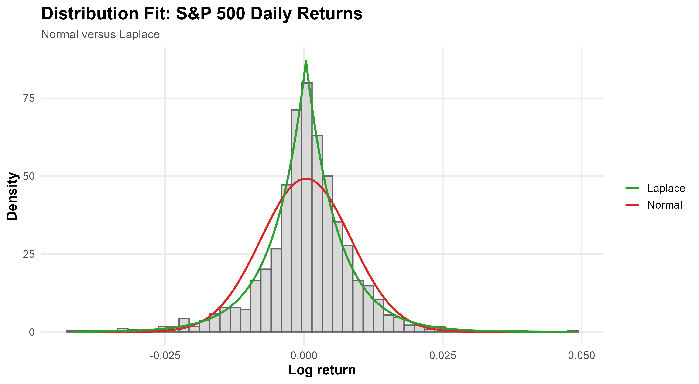
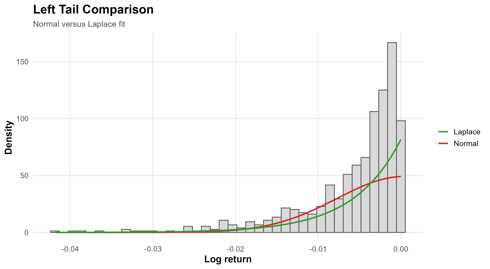
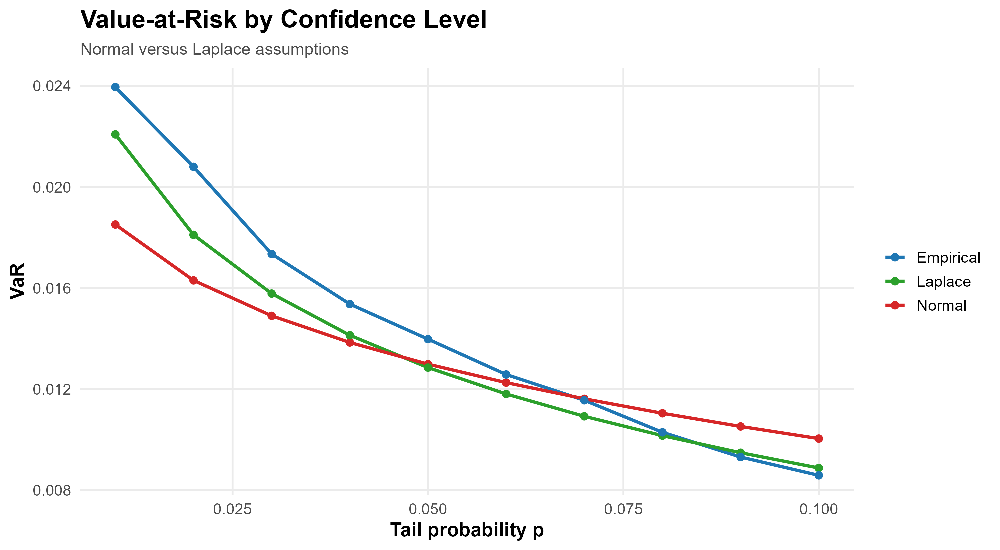
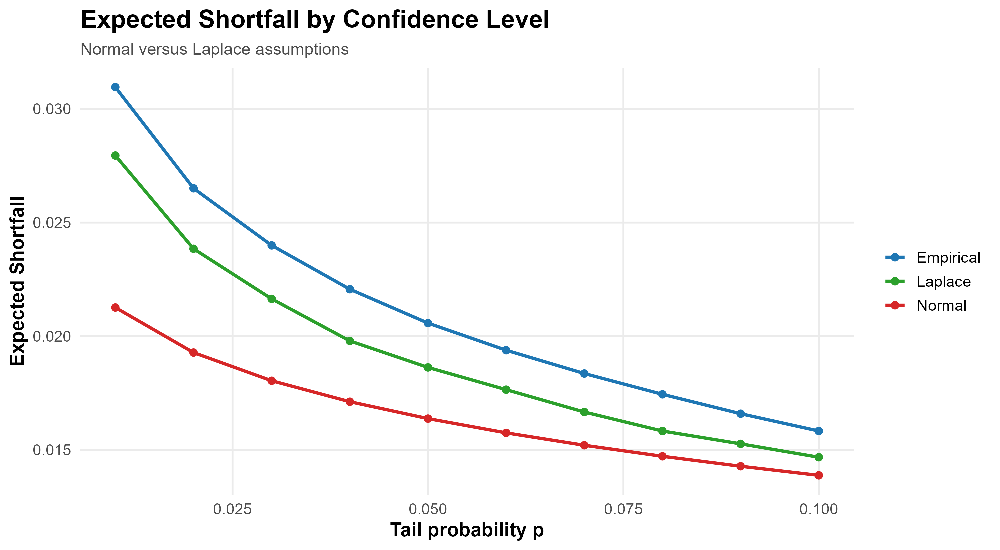
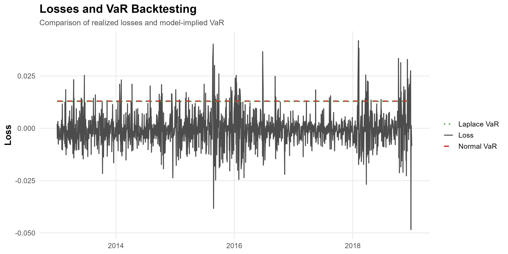
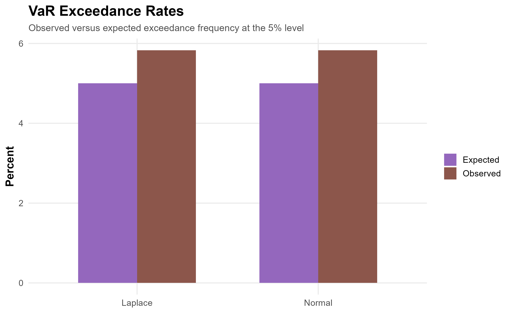
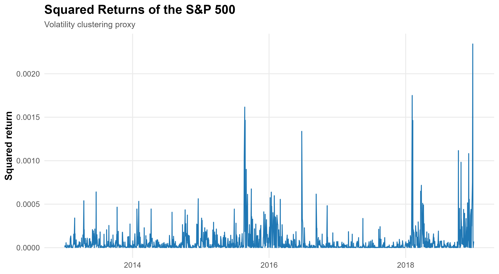

# Managing Tail Risk in Equity Markets: Beyond Gaussian Assumptions

A quantitative risk analysis project comparing Normal and Laplace distribution assumptions for Value-at-Risk (VaR) and Expected Shortfall (ES), with empirical benchmarking and backtesting on S&P 500 returns.

---

## Overview

Financial returns are well-known to deviate from Gaussian assumptions, particularly in the tails where extreme losses occur more frequently than predicted by standard models.

This project investigates how distributional assumptions impact risk estimation by addressing the following question:

> *How does replacing the Normal distribution with a heavy-tailed alternative affect the measurement and validation of financial risk?*

To answer this, the analysis combines parametric modeling, empirical benchmarks, and backtesting procedures within a structured risk management framework.

---

## Data

* Source: Yahoo Finance (S&P 500 index)
* Frequency: Daily
* Period: 2013–2018
* Variable: Log returns

---

## Methodology

### Distribution Modeling

Three approaches are considered:

* **Normal distribution**: baseline model with thin tails
* **Laplace distribution**: heavy-tailed alternative capturing excess kurtosis
* **Empirical distribution**: non-parametric benchmark derived directly from data

---

### Risk Measures

Two standard risk metrics are evaluated:

* **Value-at-Risk (VaR)**: quantile-based loss threshold
* **Expected Shortfall (ES)**: average loss beyond the VaR threshold

Each metric is computed under all three distributional assumptions.

---

### Backtesting Framework

Model performance is evaluated by comparing:

* expected exceedance rates (theoretical)
* observed exceedance rates (empirical)

This provides a direct assessment of how well each model captures extreme losses.

---

### Volatility Diagnostics

Squared returns are analyzed to detect:

* volatility clustering
* dependence structures

This challenges the i.i.d. assumption and motivates extensions toward volatility models.

---

## Results

### Distribution Fit



The Laplace distribution better captures the peaked center and heavier tails observed in financial returns compared to the Normal model.

---

### Tail Behavior



The left tail (extreme negative returns) is more pronounced than predicted by Gaussian assumptions, highlighting the importance of heavy-tailed modeling.

---

### VaR Comparison



VaR estimates differ across models, with heavier-tailed assumptions generally producing more conservative risk estimates.
The empirical VaR serves as a reference for model validation.

---

### Expected Shortfall



Expected Shortfall amplifies differences between models, as it accounts for the full tail beyond the VaR threshold.

---

### Backtesting Results





Observed exceedance rates deviate from theoretical expectations, particularly under the Normal model, indicating potential underestimation of tail risk.
The Laplace model produces more conservative exceedance behavior, closer to empirical observations.

---

### Volatility Clustering



Periods of high volatility tend to cluster, suggesting that returns are not independent and that time-varying volatility should be considered.

---

## Key Insights

* Financial returns exhibit heavy tails not captured by the Normal distribution
* Parametric assumptions significantly impact risk estimates
* Laplace-based models provide more conservative tail risk assessments
* Empirical benchmarks are essential for validating model-based estimates
* Backtesting reveals discrepancies between theoretical and observed risk
* Volatility clustering indicates the need for dynamic volatility models

---

## Technical Implementation

* Language: R
* Libraries: quantmod, ggplot2, dplyr, tseries
* Methods:

  * Maximum Likelihood Estimation (MLE)
  * Method of Moments
  * Non-parametric estimation
  * Backtesting procedures
  * Autocorrelation analysis

---

## Reproducibility

To reproduce the full analysis:

```r
source("scripts/09_run_project.R")
```

All outputs (figures and processed data) are generated automatically.

---

## Project Structure

```
.
├── README.md
├── data/
│   ├── raw/         # Ignored (large input data)
│   └── processed/   # Cleaned datasets used in analysis
├── figures/
│   ├── main/        # Final figures
│   └── diagnostics/ # Intermediate analysis
└── scripts/
    ├── 01_load_data.R
    ├── 02_fit_distributions.R
    ├── 03_var_es_analysis.R
    ├── 04_backtesting.R
    └── 09_run_project.R
```

---

## Conclusion

This project highlights the sensitivity of financial risk measures to distributional assumptions.

While the Normal model provides a convenient baseline, it tends to underestimate tail risk.
Heavy-tailed alternatives such as the Laplace distribution offer a simple yet more robust framework for capturing extreme market behavior.

Combining parametric models, empirical benchmarks, and backtesting leads to a more reliable assessment of financial risk.

---

## Extensions

Potential improvements include:

* GARCH-based volatility modeling
* Extreme Value Theory (EVT) for tail estimation
* Rolling-window risk estimation
* Multivariate risk modeling for portfolios

---
